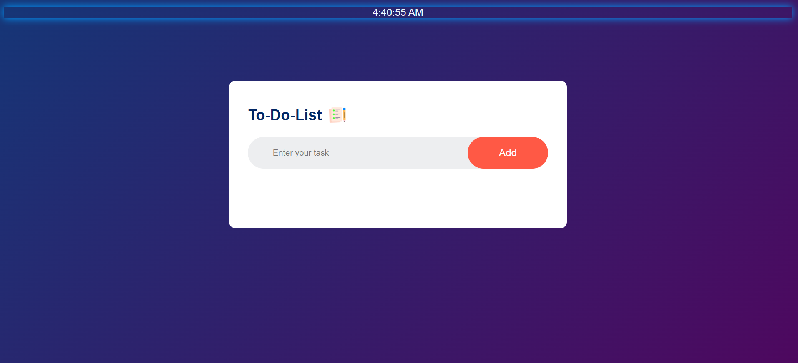

# TO-DO-Application
# 📝 To-Do Application

A modern and interactive **To-Do App** built using **HTML, CSS, and JavaScript**.
This app helps you stay organized, manage tasks efficiently, and stay motivated throughout the day.

---

## 🚀 Features

* ✅ Add, delete, and manage daily tasks
* 🕒 Live **real-time clock**
* 🎨 Beautiful **animated background UI**
* 📱 Responsive design (works on desktop & mobile)

---

## 🛠️ Tech Stack

* **HTML** – Structure
* **CSS** – Styling & animations
* **JavaScript** – Functionality

---

## 📂 Project Structure

```bash
├── index.html
├── style.css
├── script.js
```

---

## ⚙️ How to Run Locally

1. Clone the repository:

```bash
git clone https://github.com/your-username/your-repo-name.git
```

2. Open the project folder

3. Run `index.html` in your browser

---

## ✨ Future Improvements

* 🔐 User authentication
* ☁️ Save tasks using local storage / database
* Weather forecast based on user location
💬 Motivational quotes that update continuously
* 🌓 Dark / Light mode toggle
* 📅 Task scheduling & reminders

---

## 📸 Preview



---

## 🙌 Author

**Ankit Singh**

---

## ⭐ Show Your Support

If you like this project:

* Give it a ⭐ on GitHub
* Share it with others

---

## 📌 Note

This project is built for **learning and practice purposes** and can be extended into a full-stack application.

---
